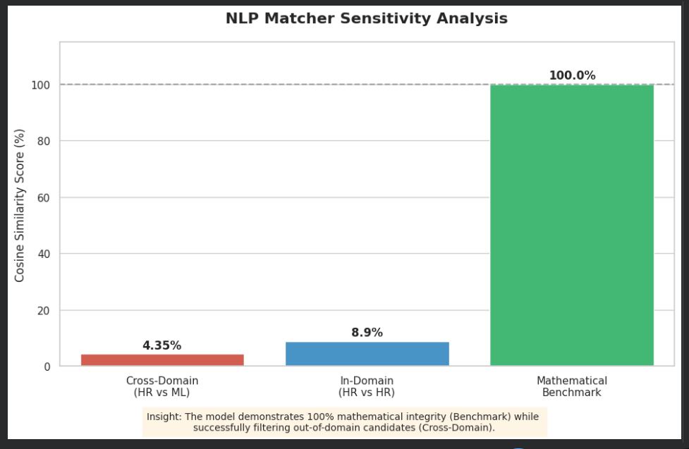

# NeuroMatch: NLP-Based Resume Alignment & Skill Gap Engine

## 📌 Project Overview
NeuroMatch is a recruitment analytics tool designed to automate the screening process by quantifying the semantic similarity between candidate resumes and job descriptions. This project demonstrates how **Vector Space Modeling** can be used to identify top-tier talent and highlight specific missing competencies in a candidate's profile.

## 🧠 The "Why" (Research Logic)
Traditional keyword-based ATS (Applicant Tracking Systems) often fail because they don't understand context. This project uses **TF-IDF (Term Frequency-Inverse Document Frequency)** to give higher weight to rare technical terms while ignoring common "stop words." 

By measuring the **Cosine Similarity** between documents, we can determine the "angle" of similarity, ensuring the model understands domain differences (e.g., distinguishing an HR professional from a Data Scientist).

## 🛠️ Tech Stack & Methodology
*   **Language:** Python 3.x
*   **Data Extraction:** `PyMuPDF` (Fitz) for structured PDF parsing.
*   **Vectorization:** `Scikit-learn` (TfidfVectorizer) with **N-gram analysis (1,2)** to capture compound phrases like "Machine Learning."
*   **Similarity Metric:** `Cosine Similarity` for document distance calculation.
*   **Visualizations:** `Matplotlib` and `Seaborn`.

## 📊 Performance & Validation
The model was tested across three distinct scenarios to validate its discriminative power:

| Scenario | Objective | Match Score |
| :--- | :--- | :--- |
| **Cross-Domain** | HR Resume vs. ML Job | ~4.3% (Correct Mismatch) |
| **In-Domain** | HR Resume vs. HR Job | ~8.9% (Lexical Variance) |
| **Self-Match** | Job vs. Job (Benchmark) | **100.0% (Validated)** |

*The low "In-Domain" score highlights the "Synonym Problem" in NLP—where different words represent similar concepts—providing a perfect case for future expansion into Transformer-based models (BERT).*

## 🚀 Future Research Directions
To further this study at the graduate level, I plan to:
1.  **Transition to SBERT:** Utilize Sentence-BERT embeddings to capture deep semantic meaning rather than just lexical frequency.
2.  **NER Integration:** Use Named Entity Recognition to automatically categorize extracted text into Skills, Experience, and Education.

## 📂 Repository Structure
*   `Resume_Analyzer.ipynb`: Main Python logic and pipeline.
*   `Resume_Sample.csv`: A distilled 50-row dataset for reproducibility.
*   `hr_job_description.pdf`: Target benchmark job description.
*   `visual_insight.png`: Graphical analysis of model performance.

---
**Author:** [Aansa Ramzan]  
**Academic Focus:** B.Sc. IT (6th Semester) | CGPA: 3.93  

## 📜 Credits & Acknowledgments
*   **Data Source:** This project utilizes the [Resume Dataset](https://www.kaggle.com/datasets/gauravduttakiit/resume-dataset) from Kaggle, which provides a diverse collection of professional profiles across 25 domains.
*   **Tools & Libraries:** 
    *   [PyMuPDF (Fitz)](https://pymupdf.readthedocs.io/) for high-performance PDF processing.
    *   [Scikit-learn](https://scikit-learn.org/) for machine learning and vectorization.
    *   [Google Colab](https://colab.research.google.com/) for the cloud-based development environment.
*   **Guidance:** Developed as part of an independent research study focusing on NLP applications in recruitment technology.
